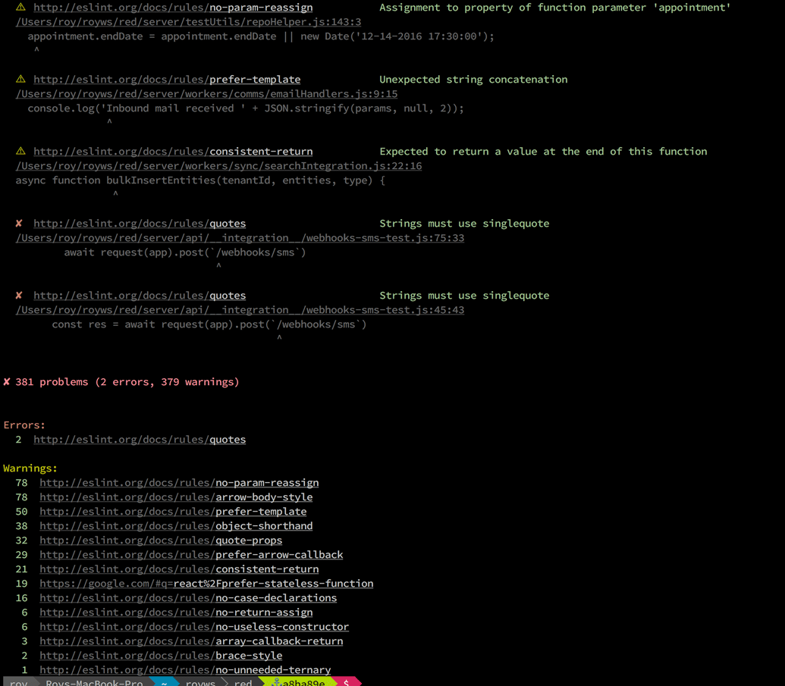

# Important

[eslint](https://github.com/nzakas/eslint/)-friendly-formatter is moved to [eslint](https://github.com/nzakas/eslint/)-formatter-friendly, check https://github.com/royriojas/eslint-friendly-formatter/issues/34 for the motivation

# [eslint](https://github.com/nzakas/eslint/)-formatter-friendly
> A simple formatter/reporter for [ESLint](https://github.com/nzakas/eslint/) that's friendly with Sublime Text and iterm2 "click to open file" functionality

[](https://npmjs.org/package/eslint-formatter-friendly)
[](https://travis-ci.org/royriojas/eslint-formatter-friendly)

## Motivation for this module

I decided to use [eslint](https://github.com/nzakas/eslint/) to verify my code and sadly the reporter was not terminal
friendly. Basically I cannot click on the file to open it with my text editor and go directly to the line where
the error was reported. This module fixes that issue, by using the syntax that "sublime text" introduced to open files.

> Filenames may be given a :line or :line:column suffix to open at a specific
> location.

This module is based on the original `stylish` formatter that is now part of ESLint, it adds the following

- All the errors are reported at the end, so no more search for errors between tons of report lines
- RuleIds are clickable on terminals like iTerm2 and take you to the ruleId documentation site.
- A summary is shown at the end with the offended ruleIds, ruleIds are also clickable.
- It also shows a bit of context where the error happened, Making easier to understand the nature of the error
- If you use [iTerm2](http://iterm2.com/) or [Guake](http://guake-project.org/)\* the link for the file becomes clickable **and will open your editor at the given line**.
  Please make sure you have properly configured the option to open uris that matches files with your editor of choice.
  Sublime is a great choice!, but this should work as well with other editors that understand the pattern used by sublime

  \* Note: Until Guake v0.7.3 is released, it may be necessary to compile master from source.

## Example of the output



## install

```bash
npm i --save-dev eslint-formatter-friendly
```

## Intellij/Webstorm/PhpStorm integration
0. Install `eslint` and `eslint-formatter-friendly`.

   ```bash
   npm i -D eslint eslint-formatter-friendly
   ```

1. Add a script to your package json like:

   ```javascript
   {
     "scripts": {
       "eslint": "eslint --format 'node_modules/eslint-formatter-friendly' file1 file2 dir1/ dir2/",
     }
   }
   ```

   **Note**: In windows you might not need the quotes around the path to the module.

   ```javascript
   {
     "scripts": {
       "eslint": "eslint --format node_modules/eslint-formatter-friendly file1 file2 dir1/ dir2/",
     }
   }
   ```

   see [issue #17](https://github.com/royriojas/eslint-formatter-friendly/issues/17)

1. Create a external tool to run eslint using this module as your formatter like this
   - program: `npm`
   - parameters: `run eslint`
   - working directory: `$ProjectFileDir$`

2. Use an output filter like:

   ```bash
   $FILE_PATH$.*:$LINE$.*:$COLUMN$
   ```
3. When launching the tool now the files will be also clickable, see:
   

## Usage

In the command line

```bash
# just make sure you pass the path to the module to the format option of eslint
eslint.js --format './node_modules/eslint-formatter-friendly/index.js' index.js test/ -c './eslint.json'
```

Or as a module

```javascript
var eslint = require('eslint');
var opts = readJson('./path/to/options');

var engine = new eslint.CLIEngine( opts );
var report = engine.executeOnFiles( ['file1.js', 'file2.js'/*, ...*/] );
var results = report.results || [];

var formatter = require('eslint-formatter-friendly');
var output = formatter(results);

// this will print the report if any...
console.log(output);

```
It works with `gulp` and `gulp-eslint`

```javascript
var friendlyFormatter = require("eslint-formatter-friendly");
// Your js task
gulp.task("javascript", function() {
  return gulp.src(["src/js/**/*.js"])
    // Your eslint pipe
    .pipe(eslint(".eslintrc"))
    .pipe(eslint.format(friendlyFormatter))
    // Continue your other tasks
    .pipe(concat("app.js"))
    .pipe(gulp.dest("dist/js"))
});
```

It should work well in with eslint-grunt or grunt-eslint

```javascript
grunt.initConfig({
    // when using eslint-grunt:
    eslint: {
        options: {
            formatter: './node_modules/eslint-formatter-friendly'
        }),
        target1: {
            //..
        }
    },
    // when using grunt-eslint:
    eslint: {
        options: {
            format: './node_modules/eslint-formatter-friendly'
        }),
        target2: {
            //..
        }
    }
});
```
## Formatter parameters

**UPDATE:**

We can pass variables to the formatter using a double dash at the end of the eslint command `-- --eff-by-issue`. So a new flag can be used to group eslint issues by `ruleId` instead as by file. This is useful if you want to fix at once all the errors/warnigs of the same kind.

~~Eslint [does not support passing parameters to formatters from the cli](https://github.com/eslint/eslint/issues/2989) yet.So in order
to pass parameters to the formatter we will have to rely on **environment variables**~~

### Command line options

#### --eff-filter

Only shows the `errors`/`warnigs` that match the given `ruleId` filter. This option will only filter the reported rules the error and warning counts will be the same as when all rules are reported same as the exit code.

```bash
eslint -f node_modules/eslint-formatter-friendly client/**/*.js server/**/*.js -- --eff-by-issue --eff-filter 'global-require' # notice the --
```

#### --eff-by-issue

Normally the reporter will group issues by file, which is handy for normal development. But there are some cases where you might want to fix all the errors of a same kind all at once. For those cases this flag can be used to make the reporter group the issues by ruleId.

```bash
eslint -f node_modules/eslint-formatter-friendly client/**/*.js server/**/*.js -- --eff-by-issue # notice the --
```

**Important**: don't forget to add the flag at the end and after `-- ` otherwise it will be interpreted as a eslint parameter and will fail as that parameter is not known to eslint.

#### --eff-absolute-paths

Same as environment variable `EFF_ABSOLUTE_PATHS`. If set to true the paths will be absolute. Otherwise they will be relative to CWD.

#### --eff-no-source

This flag can be used to disable code snippets/frames from the reported errors/warnings allowing a more compact output.

### ENV Variables

Some environment variables are identical to the [CLI options](#command-line-options) to allow for a different way of controlling the behavior of the formatter. The CLI option takes precedence, meaning any value given in the environment variable is ignored if the CLI option is specified.

#### `EFF_FILTER`

Works identically to the CLI option [--eff-filter](#--eff-filter).

```bash
export EFF_FILTER=global-require
```

#### `EFF_BY_ISSUE`

Works identically to the CLI option [--eff-by-issue](#--eff-by-issue).

```bash
export EFF_BY_ISSUE=true
```

#### `EFF_NO_SOURCE`

Works identically to the CLI option [--eff-no-source](#--eff-no-source).

```bash
export EFF_NO_SOURCE=true
```

#### `EFF_NO_GRAY`

Disable the gray color output

We use the gray color to show some info about the context where the error/warning happens. If for some reason you want to disable the gray color, [in cases like this one ](https://github.com/royriojas/eslint-formatter-friendly/pull/2), you can do it using an environment variable.

```bash
export EFF_NO_GRAY=true
```

And the gray color won't be used.

#### `EFF_ABSOLUTE_PATHS`

Make the paths of the files in the reporter be absolute instead of relative as it is by default in the received results.

Some terminals work better with relative paths (like `iTerm2` with `fish`) and other dislike it like `Guake`. So starting in version v.1.1.0 the paths will be relative by deafult. If you need the absolute please export the following variable

```bash
export EFF_ABSOLUTE_PATHS=true
```

#### `EFF_EDITOR_SCHEME`

If this parameter is set, a url will be output below the filename.

Some terminals only support clicking on urls, and editors can be configured to respond to custom url schemes.

```bash
export EFF_EDITOR_SCHEME=editor://open?file={file}&line={line}&column={column}
```

#### `EFF_CODE_FRAME_OPTIONS`

This variable allows modifying the format of the code snippets/frames in the reported errors/warnings. The variable is in the form of a stringified JSON object. The [Babel code frame options](https://www.npmjs.com/package/babel-code-frame#options) are allowed as fields in the object.

As an example where only one line of code above and below the error/warning is shown, the following value can be used for the variable:

```bash
export EFF_CODE_FRAME_OPTIONS='{ "linesAbove": 1, "linesBelow": 1 }'
```

#### `EFF_RULE_SEARCH_LINK`

When reporting an error/warning, the output will contain a web link to the eslint rule. E.g. `http://eslint.org/docs/rules/global-require`. For rules introduced by an eslint plugin the output will instead contain a link to Google Search, such as `https://google.com/search?q=%40typescript-eslint%2Fprefer-optional-chain`. If a different search engine or a direct link to another webpage is preferred, this environment variable can be used to change the prefix in front of the rule name in the link.

To link to the Duck Duck Go search engine instead, the following example can be used:

```bash
export EFF_RULE_SEARCH_LINK='https://duckduckgo.com/?q='
```

## [Changelog](./changelog.md)

## License

MIT


